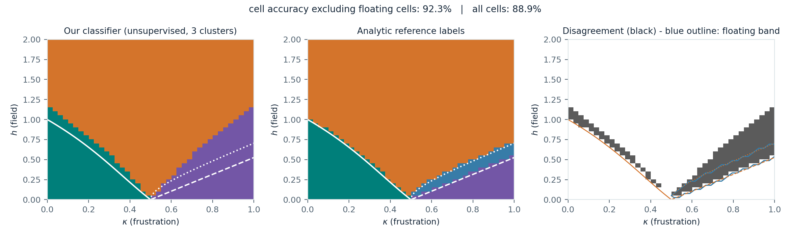
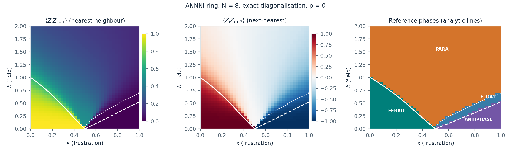
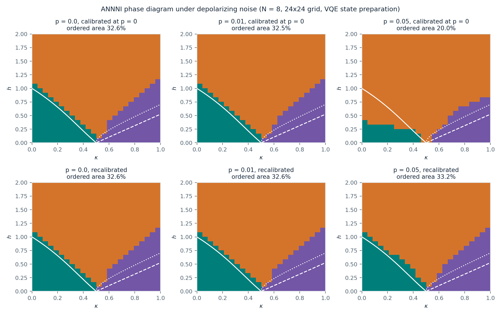
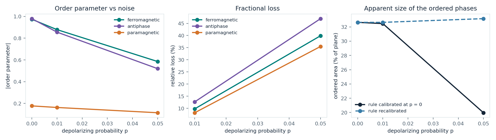
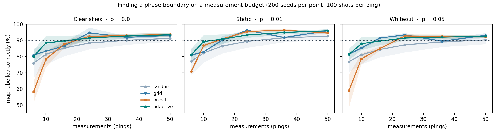
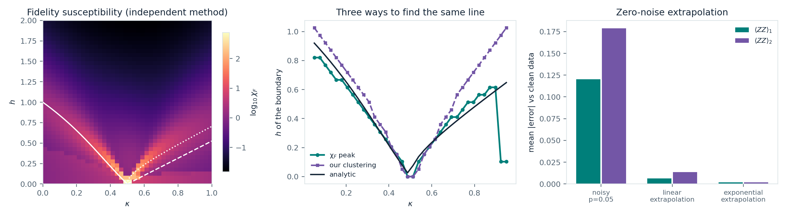
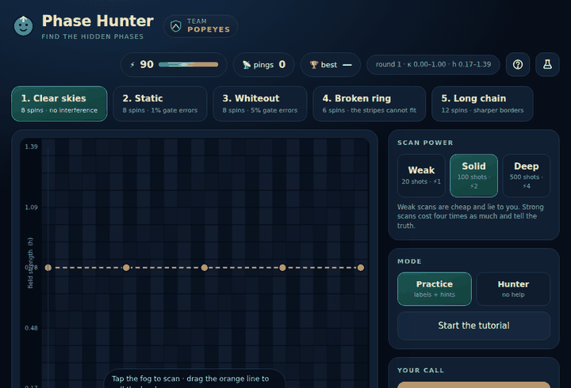

# Phase Hunter

**Q-SITE 2026 Open Challenge — Scientific Track (Quantum Coalition): mapping the ANNNI phase diagram
under noise.**

The (κ, h) phase diagram starts hidden under fog. You spend a budget of measurements, read the
correlators they return — with real shot noise — then draw where you think the boundary runs, and the
game scores your map against ground truth. Five stages change the physics underneath: ring length and
gate noise. Every round crops a different window of the plane, so the answer cannot be memorised.

The game is the presentation layer. Underneath it is the required science: phase diagrams at
p = 0, 0.01 and 0.05, an analysis of what noise does to them, a measurement-budget study of our own,
an independent second method that finds the same boundary without any classifier, and zero-noise
extrapolation that puts back what the noise took. Every number below was produced by a script in this
repository.

### Deliverables

| Required | Where | State |
|---|---|---|
| Implementation notebook | [`phase_hunter.ipynb`](phase_hunter.ipynb) | Done, executed, outputs stored |
| Phase diagram, p = 0 | [`figures/clean_phase_diagram.png`](figures/clean_phase_diagram.png) | Done |
| Phase diagrams, p = 0.01 and p = 0.05 | [`figures/phase_diagrams_noise.png`](figures/phase_diagrams_noise.png) | Done |
| Writeup, 2–3 pages | [`docs/Phase_Hunter_Writeup.pdf`](docs/Phase_Hunter_Writeup.pdf) | Done |
| Presentation video | _link goes here once recorded_ | Not recorded yet |

**Headline result.** Read with a decision rule calibrated on clean data, the ordered phases lose
**39% of their area** by p = 0.05. Re-fit that rule on the noisy data and they do not move at
all. Depolarizing noise destroys the *scale* of an order parameter, not the *location* of the
transition — what it really costs you is shots. Extrapolating the two noise levels back to p = 0
recovers that area to within 0.002 per correlator.

---

## Current results

### Clean phase diagram (p = 0), N = 8 ring, exact diagonalisation



1600 ground states on a 40 × 40 grid over κ ∈ [0, 1], h ∈ [0, 2], solved in about **9 s**. Phases are
assigned by unsupervised clustering of two measured correlators, ⟨Z_i Z_{i+1}⟩ and ⟨Z_i Z_{i+2}⟩,
with the three cluster centres seeded at three corners of the plane whose phase is not in doubt. The
reference labels come from the analytic transition lines in the challenge handout.

| Metric | Value |
|---|---|
| Cell accuracy, floating band excluded | **92.3 %** |
| Cell accuracy, all cells (floating counted as an error) | 88.9 % |
| Cells inside the reference floating band | 3.6 % |

The disagreement is not scattered: it is a band just *above* the analytic lines, where our N = 8 ring
still shows order that the thermodynamic-limit formulas say has gone. That is the expected finite-size
rounding of a transition, and the handout warns the reference lines are qualitative at finite N. We
report it rather than tuning the classifier to match the lines.



### Noisy phase diagrams (p = 0, 0.01, 0.05), N = 8



576 points on a 24 x 24 grid. At each one a hardware-efficient ansatz is fitted to the ground state on
`default.qubit`, then the same circuit is run on `default.mixed` with a depolarizing channel after
every CNOT. Fits are checked against exact diagonalisation and refitted when they land too high:
mean energy error 0.149 (1.5% of |E|), max
0.323, and the prepared state reproduces the exact correlators to
0.027 (distance 1) and 0.042 (distance 2).

**The headline result is the top row against the bottom row.** Both show the same noisy data. The top
uses a decision rule calibrated on the clean simulation; the bottom re-fits the rule on the noisy data
itself.

| | p = 0 | p = 0.01 | p = 0.05 |
|---|---|---|---|
| Ordered area, rule calibrated at p = 0 | 32.6% | 32.5% | **20.0%** |
| Ordered area, rule recalibrated | 32.6% | 32.6% | **33.2%** |
| Agreement with the analytic boundaries (recalibrated) | 92.2% | 92.2% | 91.7% |

Read with a fixed rule, the ordered phases lose 39% of
their area by p = 0.05. Recalibrated, they do not move at all. Depolarizing noise attenuates the
correlators almost multiplicatively, so it destroys the *scale* of the order parameter but not the
*location* of the transition. What noise really costs you is signal-to-noise, and therefore shots.



**Which phase is most fragile.** Deep inside each region, the fractional loss of the order parameter
at p = 0.05 is 47% for the antiphase against
40% for the ferromagnet. The antiphase is carried by the
next-nearest-neighbour correlator, a longer-range object than the ferromagnet's nearest-neighbour one,
so the same per-gate error costs it more. The paramagnet, which has little order to lose, drops
35%.

**System size must be a multiple of four.** The antiphase is a period-4 pattern, so on a ring it only
fits when N is divisible by 4. At N = 6 the ground state deep in the antiphase gives
<Z_i Z_i+2> = -0.33 instead of -0.99, and phase classification collapses to 43.5% agreement against
92.8% at N = 8. Our first noisy scan ran at N = 6 and had to be thrown away. Anyone extending this
work should pick N = 8 or 12, never 6 or 10.

---

### How many measurements does a boundary cost?



Four strategies pick where to measure under a fixed budget; each ping carries real shot noise; a
boundary is reconstructed from the pings alone and scored against ground truth over 200 seeds.
Adaptive sampling — a coarse sweep, then every remaining ping beside the current boundary estimate —
is worth the most where budget is scarce: at 10 pings on the clean stage it labels 88.3% of the map
correctly against 78.3% for bisection and 81.3% for random. Random sampling needs roughly twice the
budget of any structured strategy to clear 90%. By 36–50 pings the structured strategies sit between
92% and 94% on the clean stage while random still trails at 90–91%, so the advantage is in the cheap
regime rather than asymptotically — and that ceiling is set by our reconstruction and grid resolution,
not by the physics.

The budget ladder (6, 10, 16, 24, 36, 50) is coarse, so a crossing whose mean sits within a standard
error of the 90% line can land one rung either way on a different machine — we watched exactly that
happen between two machines while preparing this. `budget_study.py` computes the standard error at
every crossing, flags the ones that close, and writes them into `data/budget_study.json` under
`borderline_crossings`; read those as "about 36 to 50 pings", not as exact. Raising the seed count
from 40 to 200 settled one of them (adaptive at p = 0.05, from 16 pings to 24), which is why the count
is 200.

---

### A second method, and getting the scale back



Two checks close the loop.

**An independent method.** The fidelity susceptibility — how fast the ground state itself changes as
the field is turned up — shares nothing with the correlator clustering: no order parameter, no
centroids, no labels. On a finite ring the ordered phases are quasi-degenerate, so a single eigenvector
is meaningless (a solver returns an arbitrary basis of the degenerate manifold); comparing whole ground
manifolds instead makes the measure basis-invariant. Its peak sits on the analytic transition to within
**0.035 in h** for κ ≤ 0.85, below the grid spacing of
0.051 — and it fails exactly where everything else here fails, rising to
0.28 in the floating corner.

**Error mitigation.** Holding runs at two noise levels, each correlator can be extrapolated back to
p = 0 and checked against clean data the extrapolation never saw.

| Mean \|error\| vs clean data | ⟨ZZ⟩₁ | ⟨ZZ⟩₂ |
|---|---|---|
| Unmitigated, p = 0.05 | 0.120 | 0.179 |
| Richardson (linear in p) | 0.0065 | 0.0137 |
| Two-point exponential fit | **0.0019** | **0.0020** |

Read with the fixed p = 0 rule, the mitigated data recovers
32.6% ordered area
against 20.0% unmitigated: the
39% that noise erased comes back. The caveat is ours to state — our noise really is a depolarizing
channel of known strength, the friendliest case extrapolation ever sees. It confirms that the
attenuation picture above is right; it is not a claim about hardware.

---

## The game people can play



Open `game/index.html` — no server, no build step. Click the fog to measure, choose how many shots to
spend (weak scans are cheap and lie; deep scans cost four times as much), then drag the five orange
handles to call the border and press **Reveal & score**.

**Five stages, and they are different physics rather than reskins:**

| Stage | Ring | Noise | What it shows |
|---|---|---|---|
| Clear skies | 8 spins | p = 0 | The four phases, sharp |
| Static | 8 spins | p = 0.01 | Correlators fade; borders hold |
| Whiteout | 8 spins | p = 0.05 | Ordered signal is half gone |
| Broken ring | 6 spins | p = 0 | The period-4 stripes cannot fit a ring of six, so that phase never forms (43.9% agreement with the analytic lines) |
| Long chain | 12 spins | p = 0 | Borders sharpen to 95.1% |

Each round crops a random window of the (κ, h) plane, and windows that sit almost entirely inside one
phase are resampled — a window with no border in it would score 100% or 0% for no skill. **Practice
mode** labels every measurement ORDER, CHAOS or EDGE?, rings in red any measurement your line
contradicts, and offers a rough starting shape; a four-step tutorial walks the first round. **Hunter
mode** removes all of it. Two instruction pages sit behind the header icons: the rules, and what the
physics actually is.

**Send the AI** plays the bisection strategy measured in the budget study below, on the same map, with
the same budget. Beating it is the second way to win.

### Reactions (the meme layer)


Spinny, our spin-arrow mascot, reacts to what just happened, and each card is a drawn scene rather
than a caption on its own. A ping landing more than two standard deviations from the truth gets
*"Trust me bro"* over a wobbling measurement, with the reading and the true value printed underneath.
Five cheap pings in a row gets a two-panel *"20 shots is a personality"*. A ping inside the floating
band gets Spinny drifting on a balloon between the two boundary lines. Beating the agent gets the
sunglasses; losing to it gets the robot holding the trophy. Revealing your map also prints a result
panel worth screenshotting.

All thirteen cards fire on real game state, so the joke doubles as feedback about the run.

**Everything is original art.** The mascot, the props and the captions are ours, drawn as inline SVG
in `game/memes.js`. We ship no copyrighted meme images, no photographs, and no real person's likeness
— which matters for a public repo. Cards appear one at a time, are dismissible, auto-hide after four
seconds, honour `prefers-reduced-motion`, and can be switched off with the **Memes** toggle. The art
animates with CSS rather than shipping video: sonar rings pulse, fog drifts, the balloon bobs, the
stamp lands. `scripts/make_gifs.py` records the GIFs above straight from the running game, so they are
never out of date with the code.

---

## What is not done yet

| Item | Status |
|---|---|
| Presentation video | Not recorded. |
| Floating phase detection | Not attempted. The handout calls it very hard at small N; those cells are excluded from scoring and we say so rather than claiming otherwise. |
| N ≥ 12 under noise | The full scan is N = 8. `scripts/large_n_cut.py` runs two vertical cuts at N = 12 — one through each ordered phase — to test whether the scale-not-location result survives a larger ring, which is what a full scan at that size would cost hours to say. |
| Trotterised dynamics | Not attempted. Everything here is ground-state physics. |

### Two honesty notes

1. **The game runs on the real data.** Its stages are the p = 0, 0.01 and 0.05 grids from the
   PennyLane scan plus exact ground states at N = 6 and N = 12, with shot noise drawn from the exact
   per-shot standard deviations. The placeholder model in `src/noise_preview.py` survives only as an
   unused fallback and is labelled `preview_*` wherever it could appear.
2. **Which library produced which figure.** Everything involving noise — the p = 0.01 and p = 0.05
   diagrams, the noise analysis, the error mitigation — comes from PennyLane: a variational circuit
   fitted on `default.qubit` and executed on `default.mixed` with `qml.DepolarizingChannel` after
   every CNOT (`src/pennylane_pipeline.py`, run by `scripts/run_pennylane.py --scan`). The clean
   ground states can be produced by either path from the same Hamiltonian:
   `scripts/make_dataset.py --backend pennylane` takes them through `qml.dot` and `qml.matrix`, and
   the default numpy backend diagonalises the identical dense matrix the starter kit's own
   `exact_diag.py` builds. `scripts/run_pennylane.py --check` compares the two matrices element by
   element, and the PennyLane backend reports how far the two sets of observables differ.

## How to run

Only numpy and matplotlib are needed for everything except the noisy simulation, which needs
PennyLane, and `make_stages.py`, which needs scipy for the sparse ground states of the 12-spin
stage. `pip install -r requirements.txt` covers all of it.

```bash
# the notebook: every result, top to bottom
jupyter lab phase_hunter.ipynb

# clean phase diagram (exact ground states, ~9 s)
python3 scripts/make_dataset.py --qubits 8 --grid 40
python3 scripts/make_figures.py

# noisy diagrams and the noise analysis, from the committed scan
python3 scripts/analyse_noise.py --qubits 8

# how many measurements a boundary costs (~8 s)
python3 scripts/budget_study.py

# independent second method + zero-noise extrapolation (~19 s)
python3 scripts/second_method.py

# rebuild the five game stages, then play
python3 scripts/make_stages.py
open game/index.html

# regenerate the writeup PDF from the result JSON
python3 scripts/make_writeup.py
```

The noisy scan itself needs PennyLane and about an hour; its output is committed as
`data/pennylane_scan_N8.npz`, so nothing above depends on re-running it.

```bash
uv venv --python 3.14 && uv pip install "pennylane==0.44.1" numpy matplotlib
uv run python scripts/run_pennylane.py --check          # Hamiltonian vs the numpy reference
uv run python scripts/run_pennylane.py --scan --qubits 8 --grid 24

# the clean diagram through PennyLane rather than numpy, cross-checked point by point
uv run python scripts/make_dataset.py --qubits 8 --grid 40 --backend pennylane

# does the result survive a bigger ring? two cuts at N = 12
uv run python scripts/large_n_cut.py --qubits 12
python3 scripts/large_n_cut.py --analyse-only    # re-draw without re-running
```

## Repository layout

```
src/annni.py               exact ground states, correlators, per-shot standard deviations
src/reference.py           analytic boundaries and reference labels
src/classify.py            unsupervised phase classification + accuracy
src/noise_preview.py       unused placeholder noise stand-in, kept only as a fallback
src/pennylane_pipeline.py  PennyLane Hamiltonian, VQE ansatz, noisy correlators on default.mixed
scripts/make_dataset.py    exact grid scan -> data/grid_N8.npz + data/summary.json
scripts/make_figures.py    figures/
scripts/run_pennylane.py   cross-check and noise pilot
scripts/make_gifs.py       records figures/gameplay.gif and figures/memes.gif from the live game
scripts/make_stages.py     builds the five game stages (8/6/12 spins, three noise levels)
scripts/analyse_noise.py   phase diagrams under noise + the noise analysis
scripts/budget_study.py    how many measurements a boundary costs, by strategy
scripts/second_method.py   fidelity susceptibility + zero-noise extrapolation
scripts/large_n_cut.py     two noisy cuts at N = 12, where a full scan is out of reach
scripts/make_writeup.py    renders docs/Phase_Hunter_Writeup.pdf from the result JSON
phase_hunter.ipynb         the submission notebook: every result, executed
game/index.html            playable prototype (no build step)
game/memes.js              original mascot art and the thirteen reaction cards
docs/Phase_Hunter_Writeup.pdf  the submission writeup, generated from data/*.json
docs/Phase_Hunter_Plan.pdf     the original proposal, kept for history - superseded by this README
```

## The model

H = −Σ Z_i Z_{i+1} + κ Σ Z_i Z_{i+2} − h Σ X_i, on a ring (periodic boundaries), in the starter kit's
Z/Z/X convention. Nearest neighbours want to agree, next-nearest neighbours want to disagree
(frustration κ), and the transverse field h pushes every spin into superposition. The four phases are
ferromagnetic, antiphase (↑↑↓↓), paramagnetic, and the narrow floating phase.

One implementation detail worth flagging: the starter kit's `ising_transition(κ)` returns 0 at exactly
κ = 0, where the correct limit is h = 1. `src/reference.py` clamps κ away from zero so the left edge
of the grid is not mislabelled.

## Team

**Team Popeyes.** Tanish Singh Rajpal (Carnegie Mellon University, Information Networking Institute).
The physics, the code, the art and the writing in this repository are all his.

## References

1. Quantum Coalition, *QSITE 2026 Challenge — Scientific Track handout and starter kit*.
   https://github.com/benmcdonough20/QSITE-2026-QuantumCoalition — source of the Hamiltonian
   convention, the analytic transition lines (Ising, BKT, KT), the noise model, the deliverables and
   the judging rubric.
2. PennyLane demo, *Phase transitions of the ANNNI model*.
   https://pennylane.ai/qml/demos/tutorial_annni — phase definitions, VQE and QCNN approaches.
3. PennyLane challenge, *A Noisy Heisenberg Model*.
   https://pennylane.ai/challenges/heisenberg_model — the depolarizing-noise convention this track
   extends.
4. PennyLane documentation, `default.mixed` device and `qml.DepolarizingChannel`.
   https://docs.pennylane.ai
5. P. Bak and J. von Boehm, *Ising model with solitons, phasons, and "the devil's staircase"*,
   Phys. Rev. B 21, 5297 (1980) — background on the ANNNI phase structure.

Figures, code and text in this repository are our own work. The analytic boundary formulas and the
Hamiltonian convention are taken from reference 1 as the challenge requires.
